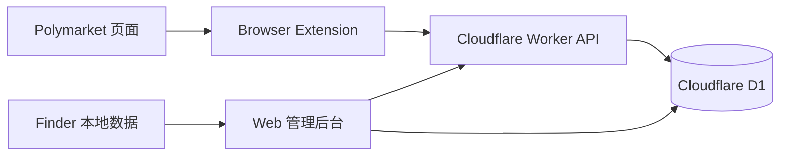

# Smart Money Pro

面向 Polymarket 的地址库工作台、Finder 同步和浏览器扩展一体化项目。

当前仓库的重点是把后台、扩展和数据层放在同一套 Cloudflare 原生架构里，方便团队持续备份、复核和迭代。

## 一眼看懂

| 模块 | 作用 |
| --- | --- |
| `apps/web` | 地址库后台、导入/复核、导出、扩展管理、运行状态 |
| `apps/worker` | 扩展鉴权、标签查询、市场标注、运行时 API |
| `apps/extension` | 页面内标签注入、Hover Card、Side Panel、登录状态保持 |
| `packages/core` | 共享类型、领域模型、通用工具 |
| `packages/data` | D1 schema、repository、迁移逻辑 |

## 主要功能

- 地址库工作台
  - 搜索、筛选、分页、复核、软删除、watchlist、保存视图
  - 地址详情、备注、标签和历史记录统一管理
- Finder 同步
  - 拉取 Finder 候选钱包
  - 预览后再写库，保留命中标签结果
  - 支持 Finder AI 线索、摘要和关键指标同步
- 浏览器扩展
  - 在 Polymarket 页内注入地址标签和 hover 详情
  - 支持 Side Panel、登录状态和搜索
  - 对 feed 区域的相邻面板识别做了稳定性处理
- 导出与备份
  - 地址库支持全量 / 增量导出
  - 便于做仓库级备份和后续恢复
- 管理能力
  - 扩展邀请码、会话管理、运行状态、恢复流程

## 架构



## 快速开始

```bash
npm install
npm run dev:web
npm run dev:worker
```

扩展开发构建：

```bash
npm run build:dev -w apps/extension
```

扩展发布构建：

```bash
npm run build:release -w apps/extension
```

## 部署

- 手动部署说明：[docs/cloudflare-deploy.md](./docs/cloudflare-deploy.md)
- API 部署脚本说明：[docs/cloudflare-api-deploy.md](./docs/cloudflare-api-deploy.md)

常用入口：

```bash
npm run deploy:cloudflare -- --domain example.com
```

## 版本记录

详细更新日志见 [CHANGELOG.md](./CHANGELOG.md)。

最近几次更新重点：

| 日期 | 重点 |
| --- | --- |
| 2026-05-07 | Finder AI insights 接入 Smart Pro，并优化 insight modal |
| 2026-05-04 | 地址库导出支持 full / delta，简化导出流程 |
| 2026-05-01 | 收紧 Finder 同步链路，提升扩展稳定性 |
| 2026-04-30 | 增加后台硬导航兜底，并记录 Workers build rollout |
| 2026-04-24 | 备份钱包复核和扩展注解更新 |

## 相关文档

- [天气 AI 导入规范](./docs/spec/weather-ai-import-spec.md)
- [Finder 钱包导出说明](./docs/finder-wallet-export.md)
- [Cloudflare Workers Builds 管理说明](./docs/cloudflare-workers-builds-admin.md)

## 安全说明

- 不要把真实密钥、Token、验证码、Cloudflare 账号信息提交进仓库
- `wrangler` 配置里的域名、邮箱、路由、资源 ID 请按自己的环境管理
- 敏感配置建议放在 Cloudflare Secrets、本地环境变量或未提交的私有配置文件里
