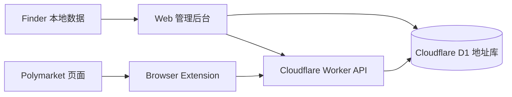

# Smart Money Pro


面向 Polymarket 的地址库后台、Finder 同步、Cloudflare Worker API 和浏览器扩展一体化项目。

Smart Money Pro 的核心目标很直接：把“地址发现、标签维护、批次导入、扩展展示、备份恢复”放进一套可持续迭代的系统里。后台不做无意义的预警中心，也不引入人工审核流程；地址库里的标签、备注和观察名单才是团队实际使用的维护入口。

## 当前版本

| 版本 | 日期 | 重点 |
| --- | --- | --- |
| `v0.2.0` | 2026-05-09 | 清理预警中心和人工审核链路，重做导入批次历史展示，同步 README 与版本记录 |

完整版本历史见 [CHANGELOG.md](./CHANGELOG.md)。

## 功能总览

| 模块 | 现在能做什么 |
| --- | --- |
| 地址库工作台 | 搜索、筛选、分页、保存视图、软删除、watchlist、标签、备注、历史记录 |
| 导入中心 | 文件 / 粘贴 / Finder 导入，导入前预览，写库后展示成功、新增、命中地址库、更新和失败统计 |
| Finder 对接 | 读取 Finder 候选钱包，保留已有手动字段，同步 Finder AI 摘要、关键指标和来源线索 |
| 浏览器扩展 | Polymarket 页面内标签注入、Hover Card、Side Panel、登录态保持和地址搜索 |
| Worker API | 扩展鉴权、标签查询、市场标注、搜索和运行时接口 |
| 运行管理 | 扩展邀请码、会话管理、Cloudflare 运行状态、恢复流程和 schema 检查 |
| 备份与导出 | 地址库 full / delta 导出，便于做仓库级备份和后续恢复 |

## 产品边界

| 保留 | 不做 |
| --- | --- |
| 地址库标签、备注、watchlist、Finder AI 线索 | 预警中心 |
| 批次导入结果统计和失败行定位 | 待处理红旗 |
| 手动维护字段保护和标签编辑 | 人工审核 / 人工审阅工作流 |
| 扩展里对旧标签的兼容隐藏逻辑 | 在后台把 AI 标签当成审核队列处理 |

## 系统架构



## 目录结构

| 路径 | 说明 |
| --- | --- |
| `apps/web` | Next.js 管理后台：地址库、导入中心、扩展管理、运行状态 |
| `apps/worker` | Cloudflare Worker：扩展 API、鉴权、市场标注、搜索 |
| `apps/extension` | 浏览器扩展：内容脚本、Side Panel、静态资源和 smoke check |
| `packages/core` | 共享类型、领域模型、通用工具和测试 |
| `packages/data` | D1 schema、repository、迁移和数据访问逻辑 |
| `docs` | 部署说明、Finder 导出说明和产品规格文档 |

## 快速开始

```bash
npm install
npm run dev:web
npm run dev:worker
```

扩展开发构建：

```bash
npm run build:dev -w apps/extension
```

完整验证：

```bash
npm run build
npm run test
```

## 部署

- Cloudflare 手动部署：[docs/cloudflare-deploy.md](./docs/cloudflare-deploy.md)
- Cloudflare API 部署脚本：[docs/cloudflare-api-deploy.md](./docs/cloudflare-api-deploy.md)
- Workers Builds 管理：[docs/cloudflare-workers-builds-admin.md](./docs/cloudflare-workers-builds-admin.md)

常用入口：

```bash
npm run deploy:cloudflare -- --domain example.com
```

## 相关文档

- [Finder 钱包导出说明](./docs/finder-wallet-export.md)
- [天气 AI 导入规范](./docs/spec/weather-ai-import-spec.md)
- [Cloudflare Workers Builds 管理说明](./docs/cloudflare-workers-builds-admin.md)

## 安全说明

- 不要把真实密钥、Token、验证码、Cloudflare 账号信息提交进仓库。
- `wrangler` 配置里的域名、邮箱、路由、资源 ID 请按自己的环境管理。
- 敏感配置建议放在 Cloudflare Secrets、本地环境变量或未提交的私有配置文件里。
